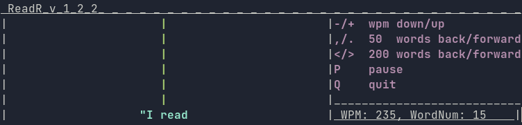

ReadR
=====

If you've ever thought, "I read too slow," then ask your doctor if ReadR might be right for you!




ReadR is a python3 command line speed reader for plain text files, with a user-friendly interface and easy control of the application both in command line arguments and during runtime.  It is a single python3 script file.  Run './ReadR.py --help' for options.

There has recently been a swarm of newly created speed reading applications, even a few terminal-based ones.  How is this one different?

**Features**

1. Offers an intuitive interface, with a control panel permanently visible by default.  Single character presses can alter wpm and navigate within the document.

2. Adjusts the timing based on word length, punctuation, and paragraph breaks.  This greatly assists in (my) comprehension when speed reading.  The program self-calibrates so that the desired wpm is approximated despite phrases having varying lengths.  There is always the option to use steady-speed as well.

3. Allows for deciding phrase length (how many words are displayed at once) by number of characters rather than words.  This makes shorter phrases like "I was a" display at once, while long words (which require more comprehensive effort) get their own phrase.  Phrases are designed never to straddle sentences or quotations, for comprehension's sake.

4. Has option to color the inside of quotation marks ("...") differently, using the --color-quotes option.  This is especially useful in the comprehension of novels, when one can easily get lost as the dialogue flies by.

5. Uses a bookmarks file to store your location in a work, and starts there the next time you read the file.

6. Colorfully formatted interface.  Yes, I know it's a command line application.  The color scheme is easily changed or disabled.

7. For the die-hard functional utilitarianists, one can disable the frivolous, trifling interface with the --minimalist option.

8. Written in one short python script, with in-code comments, for a low footprint and easy modification.

**Usage**

```
usage: ReadR.py [-h] [-w WPM] [-p PHRASE_LENGTH] [-s] [-c] [-m] FILE

User-friendly colorful command line speed reader, focused on comprehension, written in python.

positional arguments:
  FILE                  The text file to read

optional arguments:
  -h, --help            show this help message and exit
  -w WPM, --wpm WPM     The words per minute at startup. Default 350
  -p PHRASE_LENGTH, --phrase-length PHRASE_LENGTH
                        The max number of summed characters (non-whitespace) that triggers clumping of short phrases, like "I am a". Default 7
  -s, --steady-speed    Do not give special calculation to a phrase's display time, but show each phrase strictly for 60/wpm seconds
  -c, --color-quotes    Colors the text inside quotation marks ("...") differently
  -m, --minimalist      Remove the interface. Keep only the flashing words. Note that this does not affect any of the controls, or color.
```


**Bugs**

1. Terminal must be wide enough to prevent newlines being printed (about 75 characters).

2. Ctrl-C does not kill the application, because of multiple threads.  Must use "Q"


**Features to add**

1. Option for deciding focus letter.  The current behavior is just to center the phrase, which has not hindered speed or comprehension in my experience.

2. Option to parse command line output instead of a file.

3. Showing the context of the current phrase when paused, for easier navigation.


**The Controvery of Speed Reading**
(This has nothing to do with this particular application, but is good to know.)

There is great disagreement over whether or not speed reading "works." To be more specific, speed reading may or may not actually increase your comprehensive ability, increase your casual reading speed, or make you lose weight. Adding to the confusion, there are some speed readers who swear by the phrase-flashing applications (treadmill readers), while others insist on the organic approach of regulating your own speed in a physical book, so that your eyes don't become couch potatoes. One can find articles and statistics advocating every approach, so you should experiment before making a large scale commitment to any particular method.

I will attest to the fact that treadmill-readers do keep my focus more effectively than inanimate text, and prevents the subconscious rescanning of that which you already read (this is my greatest weakness). Comprehension will always suffer as speed increases, though you may think you understood everything in a text. If you are reading a book with a speed reader, review it afterwards online if you can (spark notes is good) to see if you missed anything interesting. Read more slowly at the beginning and end of long works, because comprehension is most difficult and essential at those points.  Subvocalization (considered the Achilles'  heel of speed reading) isn't smothered until about 400 WPM, but my comprehension suffers too much at that speed for me to keep up. I tend to settle out to 350 WPM as a good balance, which is almost twice as fast as I read on paper. This is only my personal experience, so you should take it with a pinch of salt, throw it out the window, and do your own research and experimentation.

Treadmill speed reading is a fairly recent art, so experiment yourself to see if it improves anything in your reading experience. Consider your improvement of speed in the application, your speed with inanimate text, and your comprehension of both, to decide if an application like this is a valuable tool for your betterment, or an undercover agent of comprehensive decreptitude.
